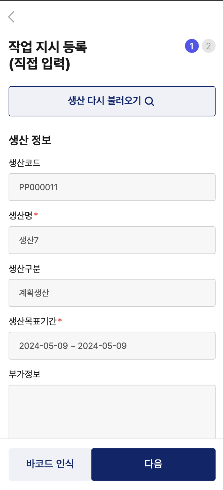
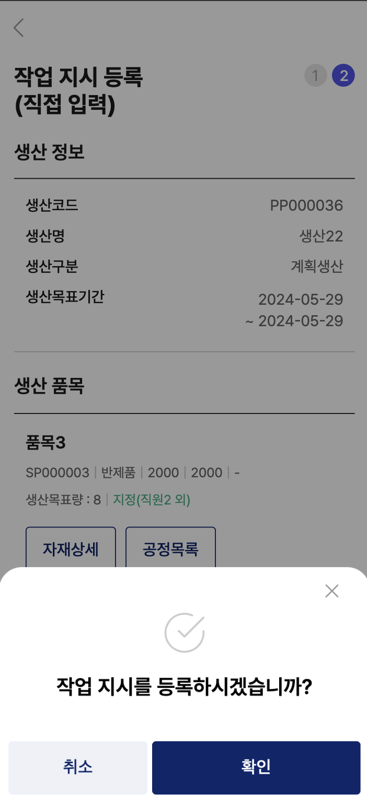

# 2024 상반기 인턴십

- 근무회사: (주)팀에브리웨어  
- 분야: 스마트팩토리 관련 ERP/MES 제조업 솔루션  
- 기간: 2024.03 ~ 2024.06  
- 인턴 직무: 웹 프론트엔드  
- 기술 스택: React.js, Next.js, JavaScript, TypeScript

## 참여 프로젝트 1  

#### ORCA 플랫폼 -ERP 제품 소개 웹사이트  

https://www.orca.partners  

- 사용 기술 스택: React.js, Next.js, JavaScript, TypeScript  
- 사용 라이브러리: material-ui, styled-components, chart.js, chart.js-2, next Image, mediaQuery, axios

#### 작업 페이지 목록

  
  

#### 메인페이지

- 웹사이트 접속 시 랜더링 되는 첫 페이지
- 뉴스, 지표, 정책 등 제조업 관련 정보와 사이트 내에 게재된 게시판 및 공지사항 확인 가능

#### 작업 부분

- 페이지 레이아웃 구성
- 반응형 네이게이션 바 제작
- 푸터 제작
- 달력: 오늘 날짜 강조 및 주간 단위로 선택 가능하도록 구현
- 경기실사지수: chart.js 라이브러리로 데이터 시각화 및 tooltip, label, legend 커스텀

#### 로직

- 메인페이지, ERP페이지에서 동일하게 사용되는 레이아웃 구성 후 `Page.getLayout` 형태로 재사용
- `@media` 쿼리를 사용하여 모바일 사이즈에서의 컴포넌트 재배치 및 조정
- `useRouter()`를 사용하여 각 항목 클릭 시 페이지 라우팅

  
  

#### ERP 페이지

- ORCA ERP 제품 소개 페이지
- 각 링크 클릭 시 해당 페이지 및 사이트로 이동

#### 작업 부분

- lazy 로딩을 사용하여 이미지 최적화
- 각 컴포넌트 구성 및 레이아웃 배치
- 다양한 디바이스 크기에 맞춘 반응형 페이지로 제작

#### 로직

- next/image 라이브러리 속성의 `loading="lazy"`를 사용하여 이미지가 뷰포트에 들어왔을 때 렌더링하여 성능 최적화
- `@media` 쿼리를 사용하여 모바일 사이즈에서의 컴포넌트 재배치 및 조정

  
  

  
  

#### 사용자 인증 페이지

- 로그인, 회원가입 페이지
- 아이디, 비밀번호 찾기, 비밀번호 변경 페이지

#### 작업 부분

- 각 필드값들의 유효성 체크
- MuiTextfield, MuiButton 등 Mui 컴포넌트 커스텀

#### 로직

- `Yup`과 `Formik` 라이브러리를 이용하여 유효성 검사 및 에러 메시지 표시
- `@mui/material` 라이브러리의 `createTheme()` 및 `ThemeProvider`를 이용하여 커스텀

#### 로직

  
  

#### 경기실사지수 페이지

- 제조업 부문별 경기실사지수를 표와 차트로 확인 가능
- 모달을 이용한 용어 정의

#### 작업 부분

- chart.js-2 라이브러리를 활용하여 tooltip, legend, label, line 등 커스텀
- 더보기 버튼 클릭 시 더 많은 제조업 분야의 데이터 확인 가능
- 외부 클릭 시 닫히는 모달 제작
- 다양한 디바이스 크기에 맞춘 반응형 페이지로 제작

#### 로직

- `useState`를 사용하여 제조업 부문 탭 상태 관리
- `useLayoutEffect`를 사용하여 DOM 렌더링 후 상태를 조작하여 화면 깜빡거림을 제거함으로써 사용자 UX 개선
- `@media` 쿼리를 사용하여 모바일 사이즈에서의 컴포넌트 재배치 및 조정

  
  

#### 디지털전환지표 페이지

- 제조업 관련 다양한 지표를 도넛, 바 차트로 확인 가능
- 모달을 이용한 용어 정의

#### 작업 부분

- Doughnut, Bar 차트 제작 및 수치 플로팅
- 더보기 버튼 클릭 시 더 많은 제조업 분야의 데이터 확인 가능
- 제조업 매출 규모, 업무 영역 드롭다운 모달 제작
- 제조업 매출 규모, 업무 영역 화살표 버튼 클릭시 슬라이딩 이동 효과

#### 로직

- chart.js-2 라이브러리의 Doughnut 차트 이용
- chartjs-plugin-datalabels 라이브러리를 이용하여 각 차트 각 항목의 수치 표시
- `useRef()`를 사용하여 드롭박스 모달 구현
- CSS의 `transform` 및 `transition` 속성을 이용하여 슬라이더 제작

#### 고객센터 문의하기 페이지

- 문의 사항 확인 및 검색
- 문의 등록

#### 작업 부분

- MuiTextfield, MuiSelect, MuiButton 등 Mui 컴포넌트 커스텀
- MuiDataGrid의 Pagination 섹션 커스텀

#### 로직

- `@mui/material` 라이브러리의 `createTheme()` 및 `ThemeProvider`를 이용하여 커스텀
- 이외에도 `sx`, `styled-componenet` 등 다양한 방법으로 컴포넌트 커스텀

#### 서비스 관리 페이지

- 기간 별 요금제 및 제공 서비스 확인 가능

#### 작업 부분

- Tab Section 제작
- Tab Item 제작

#### 로직

- `useState()`를 사용하여 기간 별 해당 요금제 렌더링
- `map()` 함수를 사용하여 렌더링

  
  

#### 결제 페이지

- 구독할 요금제 카드 등록/선택 후 결제

#### 작업 부분

- 구독 상품 불러오기
- 카드 선택
- 약관 동의 모달
- 카드 결제 구현

#### 로직

- `router`의 query Param으로 구독할 상품 정보 전달
- `GET` API로 카드 조회 및 `POST` API로 실 카드 결제 기능 구현
- Material Ui의 `FormControlLabel`과 `Dialog` 컴포넌트로 약관 모달 제작
- `useState()`를 사용한 유효성 체크로 필수 약관 미동의 시 구독 버튼 비활성화

  
  

#### 카드 선택/등록 페이지

- 구독할 요금제 카드 등록/선택 후 결제

#### 작업 부분

- 카드 선택
- 카드 등록 UI 변경
- 약관 동의

#### 로직

- `GET` API로 등록한 카드 모두 조회 후 선택한 카드 정보 결제 시 전달
- 구독 시에 카드 등록 가능하도록 페이지 추가 후 기존 UI 변경
- 약관 개별선택 및 모두선택의 경우 토글 로직 구현

## 참여 프로젝트 2  

### ORCA 웹앱 -ERP 서비스  

https://www.orca.partners  

- 사용 기술 스택: React.js, Next.js, TypeScript  
- 사용 라이브러리: react-redux, emotion, next Image, axios

### 작업 페이지 목록

#### 로그인 페이지

- 아이디, 비밀번호, 회사코드 입력 후 로그인
- 자동로그인, 아이디 저장 가능

#### 작업 부분

- 로그인 로직 구현
- 자동로그인, 아이디 저장 기능 구현
- 로그인 후 사용자 정보 저장

#### 로직

- 각 필드의 값을 `useState()`로 관리하여 유효성 체크 및 유효하지 않을 시 에러메시지 표시
- `window.LocalStorage`를 이용하여 자동로그인, 아이디 저장 체크 여부 저장 후 값에 따라 기능 활성화
- 로그인 토큰 만료 시 로그인 페이지로 리로드
- Redux의 `useDispatch()`를 사용하여 컴포넌트 최상단에 사용자 정보 저장
- 로그인 API를 사용하여 사용자 데이터 `POST`

  
  

#### 아이디/비밀번호 찾기 페이지

- 이름, 휴대폰 번호, 회사코드 입력 후 아이디 찾기
- 이름, 이메일, 회사코드 입력 후 비밀번호 찾기

#### 작업 부분

- 유효성 검사
- 인증번호 타이머 구현
- 모달창으로 전송 결과 알림

#### 로직

- 각 필드의 값을 `useState()`로 관리하여 유효성 체크 및 유효하지 않을 시 에러메시지 표시
- 휴대폰 인증번호 발송 시 `setInterval()`함수를 이용하여 3분 시간 제한
- `useState()`와 `modalOpen()`, `modalClose()` 등의 함수로 모달 제어
- 인증번호 발송, 인증번호 확인, 아이디찾기/비밀번호 찾기 등의 `POST` API 연동

#### 사이드바

- 회원 정보 확인 및 각종 메뉴로 이동

#### 작업 부분

- 사용자 이름 표시
- 하위 메뉴 토글 기능
- 각 메뉴들 및 하위 메뉴들에 대해 재사용 가능한 컴포넌트 제작

#### 로직

- Redux의 `useSelector()`를 사용하여 `store`에 저장된 사용자 이름 get
- Redux의 `useDispatch()` 및 정의한 `action`으로 사이드바 열림/닫힘 상태 제어 및 컴포넌트 최상단에서 상태 관리

  
  
  
  

#### 검색 모달

- 띄워진 항목들 확인햐여 선택하거나 검색하여 항목 선택

#### 작업 부분

- 데이터 리스트로 띄우기
- 단어 검색 및 초성 검색 로직 구현
- 단일 선택

#### 로직

- `GET` API로 불러온 데이터를 정제하여 `useState()`에 저장 후 `map()` 함수로 리스트 형태로 데이터 표시
- 검색할 시 `filter()` 함수로 검색된 결과 필터링 후 일치하는 단어 컬러링
- 정규표현식을 이용하여 초성 검색 구현
- 데이터 특성에 따라 단일선택/다중선택 한 후 `onSetItem`으로 선택된 항목 반환

  
  
  
  

  
  

#### 작업지시 - 작업지시 등록 페이지

- 생산 계획을 바탕으로 작업 지시 등록

#### 작업 부분

- 생산 조회 서치 모달 제작
- 선택한 생산 정보로 작업 지시 Input 자동 완성
- 선택된 생산 상세 정보 표시

#### 로직

- `GET` API로 생산 정보 불러오기
- API query에 검색값 전달하여 검색 구현
- 선택된 데이터의 `index`를 받아온 후 해당 생산정보만 필터링
- `POST` API로 작업지시 데이터 등록
- 임시저장 데이터 있는 경우와 없는 경우 분기처리하여 데이터 포맷

  
  

#### 작업지시 - 재료재고, 창고 선택 페이지

- 창고 별 재료 차감 개수 수정

#### 작업 부분

- 재료 및 창고에 대한 데이터 표시
- 각 창고의 차감 개수 수정에 따른 총 재료 차감 개수 수정

#### 로직

- `GET` API로 창고 및 재료 정보 불러오기
- 각각 다른 컴포넌트에서 동시에 이루어지는 수정으로 `useState()` 대신 `useRef()`로 값 제어
- 수정된 임시저장 데이터 `POST` API로 전달

  
  
  
  

#### 작업지시 - 공정목록, 일정상세 페이지

- 공정별, 일자별 담당자 지정

#### 작업 부분

- 공정 데이터 표시
- 공정기간 세분화하여 일자별로 분리
- 일자별 담당자 지정 및 일괄지정 가능

#### 로직

- `GET` API로 공정 정보 불러오기
- 날짜 분리 함수 제작하여 공정기간 일자별로 분리
- 작업지시량 배분 함수 제작하여 균등하게 배분
- `useState()`로 일자별 담당자 / 일괄 담당자 각각 상태관리
- 수정된 임시저장 데이터 `POST` API로 전달
